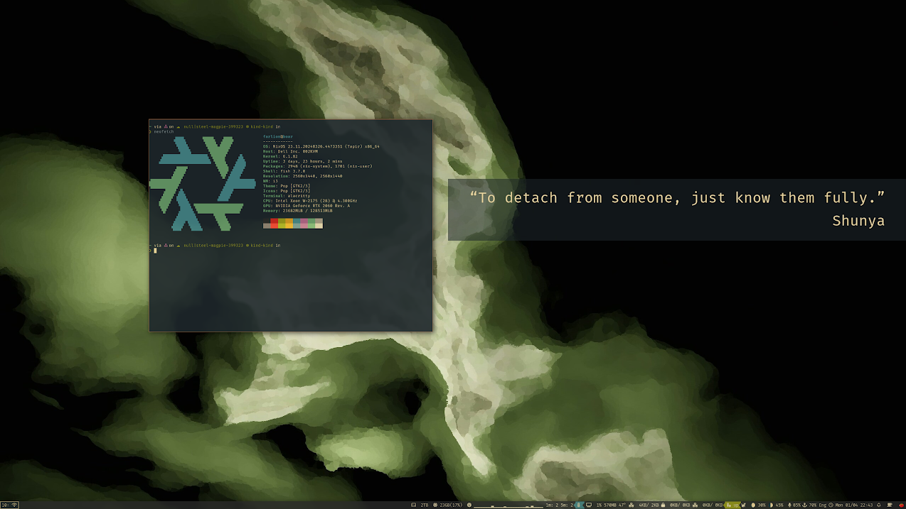
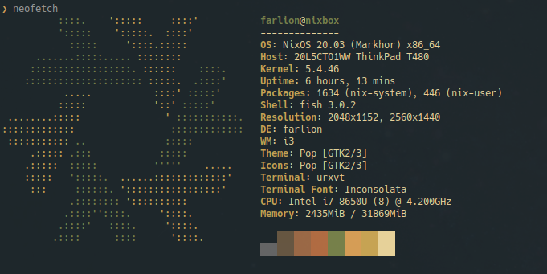

[](https://builtwithnix.org)
[](https://github.com/workflow/nixos-config/actions/)

# Dotfiles on Steroids - NixOS configuration

Workflow's current, and immutably evolving, NixOS configuration files, home-manager, neovim, etc.




Used as daily driver since 2020.

## Installation Instuctions

### Create a bootable USB drive

- Download NixOS to `$ISO_PATH`
- insert drive
- `lsblk` -> find out drive name (e.g. `/dev/sdb`) `$DRIVE`
- run (as sudo) `dd bs=4M if=$ISO_PATH of=$DRIVE conv=fdatasync status=progress && sync`

### Preparing Windows 10 to keep a Bootable Windows Partition

Roughly this https://github.com/andywhite37/nixos/blob/master/DUAL_BOOT_WINDOWS_GUIDE.md

1. Install all updates
1. Create a windows recovery USB Drive (Search for "Create Recovery Drive") [Fair warning: This is slooooooooow]
1. Shrink main Windows partition using built-in Disk Management tool
1. Use Macrorit Partition Expert to extend EFI partition to 1024MB
1. (optional) Delete Recovery Partition(s)
1  Install NixOS as below, re-using the existing EFI boot partition setup by Windows, and things should work with systemd-boot out of the box!

### Preparing Windows 10 to keep a Bootable Windows Partition

Roughly this https://github.com/andywhite37/nixos/blob/master/DUAL_BOOT_WINDOWS_GUIDE.md

- Install all updates from Windows
- Create a windows recovery USB Drive (Search for "Create Recovery Drive") [Fair warning: This is slooooooooow]
- Shrink Main Windows partition and throw NTFS on it
- Disable Bitlocker
- Go to BIOS, disable Secure Boot and maybe fast startup
- Install NixOS as below, re-using the existing EFI boot partition setup by Windows, and things should work with systemd-boot out of the box!


### Actual installation

Roughly this https://qfpl.io/posts/installing-nixos/

- sudo -i
- lsblk -> find out disk name (e.g. `/dev/sda`) `$DISK`
- `export DISK=/dev/sda`
- `gdisk $DISK`
  - `p` (print)
  - `d` (delete)
  - `n` (new)
    - number=1, begin=default, end=`+1G`, hex code=`ef00` (not needed if dual boot) (`$BOOT` from now on, or `/dev/sda1` etc)
    - number=2, begin=default, end=default, hex code=`8e00` (`$MAIN` from now on)
  - `w` (write)
- `export BOOT=/dev/sda1`
- `export MAIN=/dev/sda2`
- encryption
  - `cryptsetup luksFormat $MAIN`
  - `cryptsetup luksOpen $MAIN nixos-enc`
  - `pvcreate /dev/mapper/nixos-enc`
  - `vgcreate nixos-vg /dev/mapper/nixos-enc`
  - `lvcreate -L <swap size, e.g. 8G, usually pick 2xRAM for hibernation if space doesn't matter> -n swap nixos-vg`
  - `lvcreate -l 100%FREE -n root nixos-vg`
- create fs
  - `mkfs.vfat -n boot $BOOT` (not needed if dual boot)
  - `mkfs.ext4 -L nixos /dev/nixos-vg/root`
  - `mkswap -L swap /dev/nixos-vg/swap`
  - `swapon /dev/nixos-vg/swap`
- mount
  - `mount /dev/nixos-vg/root /mnt`
  - `mkdir /mnt/boot`
  - `mount $BOOT /mnt/boot`
- generate config
  - `nixos-generate-config --root /mnt`
- add stuff to config

required:
```nix
boot.initrd.luks.devices = {
  root = {
    device = "$MAIN";
    preLVM = true;
  };
};

# If not dual-booting with GRUB
boot.loader.systemd-boot.enable = true;

networking.networkmanager.enable = true;

users.users.farlion = {
  extraGroups = ["wheel" "video" "audio" "disk" "networkmanager"];
  isNormalUser = true;
};
```

- nixos go brrrr
  - `nixos-install`
  - `reboot`

to have a DM after first boot:

```nix
services.xserver = {
  enable = true;
  displayManager = {
    gdm = {
      enable = true;
      wayland = false;
    };
  };
  desktopManager.plasma5.enable = true;  # or xfce or whatever
  # or
  # windowManager.xmonad.enable = true;

  # to be able to mount an external drive to get secrets etc. for cloning from gh
  boot.supportedFilesystems = [ "ntfs" ];

};
```

### Useful

- connect to internet from nmcli
  - find out interface: `nmcli d` (`$IF`)
  - enable interface: `nmcli r wifi on`
  - search networks: `nmcli d wifi list`
  - connect: `nmcli d wifi connect $(B)SSID password $PASSWORD`

### Enable this setup

(`$NIXOS_CONFIG` is the location of this repo)

1. change your name to `farlion` because it's hardcoded in the configurations
1. `passwd farlion` and then `su`
1. `git clone https://github.com/workflow/nixos-config.git $NIXOS_CONFIG`
1. From`$NIXOS_CONFIG/machines/*/system.nix` as a template, set required settings like the `networking.hostname` and the correct networking interfaces to enable DHCP
1. `sudo nix-channel --add https://github.com/NixOS/nixos-hardware/archive/master.tar.gz nixos-hardware` -> still needed? 🤔
1. `sudo nix-channel --update` -> still needed? 🤔
1. `sudo mkdir -m 0755 -p /nix/var/nix/{profiles,gcroots}/per-user/farlion` (for `home-manager`) -> still needed? 🤔
1. Update flake.nix with new machine (preferably name = hostname)
1. `nix shell nixpkgs#cachix -c cachix use workflow-nixos-config`
1. `sudo nixos-rebuild switch --flake $NIXOS_CONFIG#<machine name, empty if hostname> --override-input secrets nixpkgs`
1. Reboot

### Post-installation steps

1. On an existing syncthing device, mutually add the new device
1. Push addition of new syncthing device + folder sharing settins on old device
1. On new device, Accept new folders as "Receive only" (check the path is correct!) on new device and let it sync
1. Push any local `$NIXOS_CONFIG` config changes to github
1. Remove local `$NIXOS_CONFIG` and symlink it to `~/code/nixos-config`
1. Symlink `~/nixos-secrets` to `~/code/nixos-secrets`
1. Change `root` passwd
1. Rerun `n`
1. Reboot
1. Login to mega (`mega-cmd` for interactive mode)
1. Manually set up Duplicati backups (config under ~/.backup)
1. Rerun `n`
1. Reboot

## Moving an Existing Installation to a new Disk

1. Prepare the new disk according to the [Partitioning Information](https://github.com/workflow/dotfiles?tab=readme-ov-file#installation-instuctions) up to the point just before mounting the swap/disks
1. Update the hardware configuration (e.g. `nixos-config/machines/my-machine/hardware-scan.nix` and maybe `nixos-config/machines/my-machine/system.nix`) to point to the new partitions 
1. Mount the new boot partition in-place: `sudo mount $NEWBOOT /boot`
1. Install the new configuration, including bootloader: `sudo nixos-rebuild boot --install-bootloader --flake .#my-machine`
1. Reboot into an installation disk
1. Mount the old root parition at `/mnt/old`
1. Mount the new root parition at `/mnt/new`
1. Copy everything over, preserving creation times with `-N` for syncthing:
```bash
rsync -aAXvN --exclude={"/dev/*","/proc/*","/sys/*","/tmp/*","/run/*","/mnt/*","/media/*","/lost+found"} /mnt/old/ /mnt/new
```
1. Reboot into the new drive and enjoy =)


## Useful notes

[Useful Notes](NOTES.md)

## Acknowledgements

A lot of this was looted from https://github.com/alexpeits/nixos-config. Thank you!

CI build ~stolen from~ inspired by https://github.com/gvolpe/nix-config

## History


