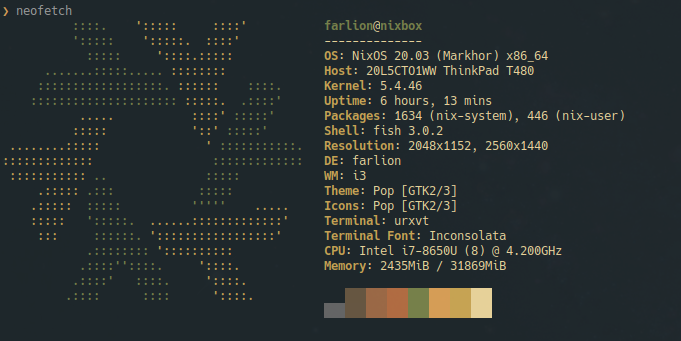

[](https://builtwithnix.org)



# NixOS configuration

## Create a bootable USB drive

- Download NixOS to `$ISO_PATH`
- insert drive
- `lsblk` -> find out drive name (e.g. `/dev/sdb`) `$DRIVE`
- run (as sudo) `dd bs=4M if=$ISO_PATH of=$DRIVE conv=fdatasync status=progress && sync`

## Actual installation

Roughly this https://qfpl.io/posts/installing-nixos/

- lsblk -> find out disk name (e.g. `/dev/sda`) `$DISK`
- `gdisk $DISK`
  - `p` (print)
  - `d` (delete)
  - `n` (new)
    - number=1, begin=default, end=`+1G`, hex code=`ef00` (not needed if dual boot) (`$BOOT` from now on, or `/dev/sda1` etc)
    - number=2, begin=default, end=default, hex code=`8e00` (`$MAIN` from now on)
  - `w` (write)
- encryption
  - `cryptsetup luksFormat $MAIN`
  - `cryptsetup luksOpen $MAIN nixos-enc`
  - `pvcreate /dev/mapper/nixos-enc`
  - `vgcreate nixos-vg /dev/mapper/nixos-enc`
  - `lvcreate -L <swap size, e.g. 8G> -n swap nixos-vg`
  - `lvcreate -l 100%FREE -n root nixos-vg`
- create fs
  - `mkfs.vfat -n boot $BOOT` (not needed if dual boot)
  - `mkfs.ext4 -L nixos /dev/nixos-vg/root`
  - `mkswap -L swap /dev/nixos-vg/swap`
  - `swapon /dev/nixos-vg/swap`
- mount
  - `mount /dev/nixos-vg/root /mnt`
  - `mkdir /mnt/boot`
  - `mount $BOOT /mnt/boot`
- generate config
  - `nixos-generate-config --root /mnt`
- add stuff to config
  - if dual boot check out https://nixos.wiki/wiki/Dual_Booting_NixOS_and_Windows

dual boot:
```nix
boot.loader.grub.enable = true;
boot.loader.grub.version = 2;
boot.loader.grub.device = "/dev/sda";
boot.loader.grub.useOSProber = true;
```

required:
```nix
boot.initrd.luks.devices = {
  root = {
    device = "$MAIN";
    preLVM = true;
  };
};

boot.loader.systemd-boot.enable = true;

networking.networkmanager.enable = true;

users.extraUsers.farlion = {
  createHome = true;
  extraGroups = ["wheel" "video" "audio" "disk" "networkmanager"];
  group = "users";
  home = "/home/farlion";
  isNormalUser = true;
  uid = 1000;
};
```

- nixos go brrrr
  - `nixos-install`
  - `reboot`

to have a DM after first boot:

```nix
services.xserver = {
  enable = true;
  displayManager = {
    gdm = {
      enable = true;
      wayland = false;
    };
  };
  desktopManager.plasma5.enable = true;  # or xfce or whatever
  # or
  # windowManager.xmonad.enable = true;

  # to be able to mount an external drive to get secrets etc. for cloning from gh
  boot.supportedFilesystems = [ "ntfs" ];

};
```

## Useful

- connect to internet from nmcli
  - find out interface: `nmcli d` (`$IF`)
  - enable interface: `nmcli r wifi on`
  - search networks: `nmcli d wifi list`
  - connect: `nmcli d wifi connect $(B)SSID password $PASSWORD`

## Enable this setup

(`$CONFIG` is the location of this repo)

1. change your name to `farlion` because it's hardcoded in the configurations
1. `passwd farlion` and then `su`
1. `git clone https://github.com/workflow/nixos-config.git $CONFIG`
1. Add `$CONFIG/configuration.nix` to the imports in `/etc/nixos/configuration.nix` (sample configuration is in `assets`)
1. Add `$CONFIG/nixos-config/hardware-configuration.nix` to the same list
1. From`$CONFIG/assets/root-configuration-*.nix` as a template, set required settings like the `networking.hostname` and the correct networking interfaces to enable DHCP
1. `sudo nix-channel --add https://github.com/NixOS/nixos-hardware/archive/master.tar.gz nixos-hardware`
1. `sudo nix-channel --update`
1. `sudo mkdir -m 0755 -p /nix/var/nix/{profiles,gcroots}/per-user/farlion` (for `home-manager`)
1. `sudo nixos-rebuild switch`

## Post-installation steps

1. On another device, accept syncthing and update the config file there to add new device
1. Accept new folders as "Receive only" (check the path is correct!) on new device and let it sync
1. Push any local `$CONFIG` config changes to github
1. Remove local `$CONFIG` and symlink it to `~/code/nixos-config`
1. Copy and symlink `/etc/nixos/configuration` to a new asset file under `assets/`
1. Change `root` passwd
1. Login to mega (`mega-cmd` for interactive mode)
1. Manually set up Duplicati backups (config under ~/.backup)

## Acknowledgements

A lot of this was looted from https://github.com/alexpeits/nixos-config. Thank you! 
