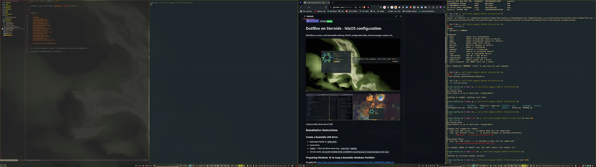

# dotfiles-on-steroids [NixOS Config]

Workflow's current, and immutably evolving, NixOS configuration files, home-manager, neovim, etc.

Used as daily driver since 2020. 😎

## Programs

Checkout the `home` directory for an up-to-date list of installed goodies. Here's a few shoutouts:

| Type             |                                 Program                                 |
| :--------------- | :---------------------------------------------------------------------: |
| AI IDE           |             [Avante](https://github.com/yetone/avante.nvim)             |
| Animal           | [Raccoon](https://duckduckgo.com/?hps=1&q=raccoon&iax=images&ia=images) |
| Backups          |               [Restic](https://github.com/restic/restic)                |
| Display Manager  |                [Ly](https://codeberg.org/AnErrupTion/ly)                |
| Editor           |                      [NeoVim](https://neovim.io/)                       |
| File Manager     |                  [Lf](https://github.com/gokcehan/lf)                   |
| File Syncing     |           [Syncthing](https://github.com/syncthing/syncthing)           |
| Impermanence     |      [Impermanence](https://github.com/nix-community/impermanence)      |
| Launcher         |               [Fuzzel](https://codeberg.org/dnkl/fuzzel)                |
| Nix Builds       |                   [Nh](https://github.com/viperML/nh)                   |
| Notifications    |             [Dunst](https://github.com/dunst-project/dunst)             |
| Prompt           |            [Starship](https://github.com/starship/starship)             |
| Power Management |       [Auto-Cpufreq](https://github.com/AdnanHodzic/auto-cpufreq)       |
| Secrets Mgmt     |              [Sops-Nix](https://github.com/Mic92/sops-nix)              |
| Screenshots      |                 [Satty](https://github.com/gabm/Satty/)                 |
| Shell            |                     [Fish](https://fishshell.com/)                      |
| Shell when data  |                   [Nushell](https://www.nushell.sh/)                    |
| Status Bar       |               [waybar](https://github.com/Alexays/Waybar)               |
| Style Manager    |                [stylix](https://github.com/danth/stylix)                |
| Terminal         |           [Alacritty](https://github.com/alacritty/alacritty)           |
| Version Control   |                 [JJ](https://github.com/jj-vcs/jj)                  |
| Window Manager   |                 [Niri](https://github.com/YaLTeR/niri)                  |

## Lack of Aesthetics

| Type           |                             Name                              |
| :------------- | :-----------------------------------------------------------: |
| Monospace Font |        [FiraCode](https://github.com/tonsky/FiraCode)         |
| Emoji Font     | [Noto Color Emoji](https://github.com/googlefonts/noto-emoji) |
| Dark Theme     |         [Gruvbox](https://github.com/morhetz/gruvbox)         |
| Light Theme    | [Catppuccin Latte](https://github.com/catppuccin/catppuccin)  |

Switching between Light and Dark theme is currently done via [NixOS Specialisation](specialisations/light/default.nix).

## I Wanna Install

You likely don't want to, as this config is heavily customized to my needs.

But here's a rough guide:

[Setup Instructions](doc/INSTALL.md)

## Architecture

This configuration follows the [dendritic pattern](doc/DENDRITIC.md) using flake-parts.

## Upgrades

- [Upgrade Checklist](doc/upgrades/Checklist.md)
- [NixOS 24.11 Upgrade Adventures](doc/upgrades/2411/NixOS-24.11.md)
- [NixOS 24.05 Upgrade Adventures](doc/upgrades/2405/NixOS-24.05.md)

## Notes

- [Moving an Existing Installation to a new Disk](doc/MOVING.md)

## Acknowledgements

- A lot of this was initially looted from https://github.com/alexpeits/nixos-config. Thank you!

- CI build and many other goodies ~stolen from~ inspired by https://github.com/gvolpe/nix-config

- Vimjoyer's fantastic YouTube channel: https://www.youtube.com/@vimjoyer

## History

