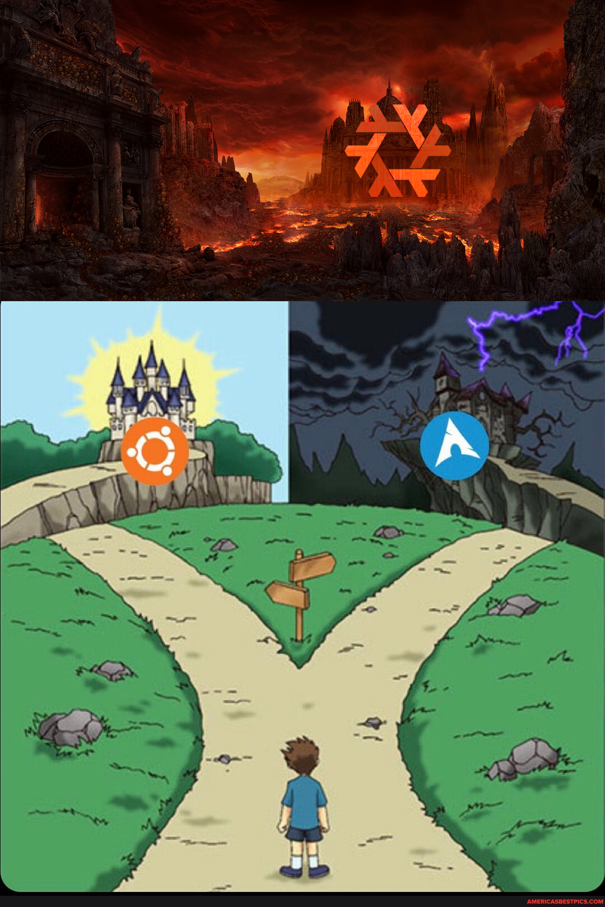

# dotfiles-on-steroids [NixOS Config]

Workflow's current, and immutably evolving, NixOS configuration files, home-manager, neovim, etc.

Used as daily driver since 2020. 😎

## Programs

Checkout the `home` directory for an up-to-date list of installed goodies. Here's a few shoutouts:

| Type            | Program      |
| :-------------- | :----------: |
| Backups         | [Restic](https://github.com/restic/restic) |
| Editor          | [NeoVim](https://neovim.io/) |
| File Manager    | [Lf](https://github.com/gokcehan/lf) |
| File Syncing    | [Syncthing](https://github.com/syncthing/syncthing) |
| Launcher        | [Rofi](https://github.com/davatorium/rofi) |
| Nix Builds      | [Nh](https://github.com/viperML/nh) |
| Notifications   | [Dunst](https://github.com/dunst-project/dunst) |
| Prompt          | [Starship](https://github.com/starship/starship) |
| Shell           | [Fish](https://fishshell.com/) |
| Shell when data | [Nushell](https://fishshell.com/) |
| Status Bar      | [i3status-rust](https://github.com/greshake/i3status-rust) |
| Terminal        | [Alacritty](https://github.com/alacritty/alacritty) |
| Animal          | [Raccoon](https://duckduckgo.com/?hps=1&q=raccoon&iax=images&ia=images) |
| Window Manager  | [i3](https://github.com/i3/i3) |

## Lack of Aesthetics

| Type                    | Name         |
| :---------------------- | :----------: |
| Terminal Font           | [FiraCode](https://github.com/tonsky/FiraCode) |
| I3 Theme (inspiration)  | [Nature](https://github.com/Kthulu120/i3wm-themes/tree/master?tab=readme-ov-file) |
| Neovim Theme            | [Gruvbox](https://github.com/morhetz/gruvbox) |

## I Wanna Install

You likely don't want to, as this config is heavily customized to my needs.

But here's a rough guide:

[Setup Instructions](doc/INSTALL.md)

## Notes

* [Moving an Existing Installation to a new Disk](doc/MOVING.md)

## Acknowledgements

* A lot of this was initially looted from https://github.com/alexpeits/nixos-config. Thank you!

* CI build and many other goodies ~stolen from~ inspired by https://github.com/gvolpe/nix-config

* Vimjoyer's fantastic YouTube channel: https://www.youtube.com/@vimjoyer

## History

