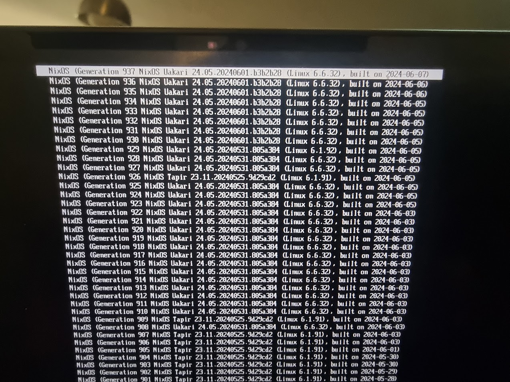
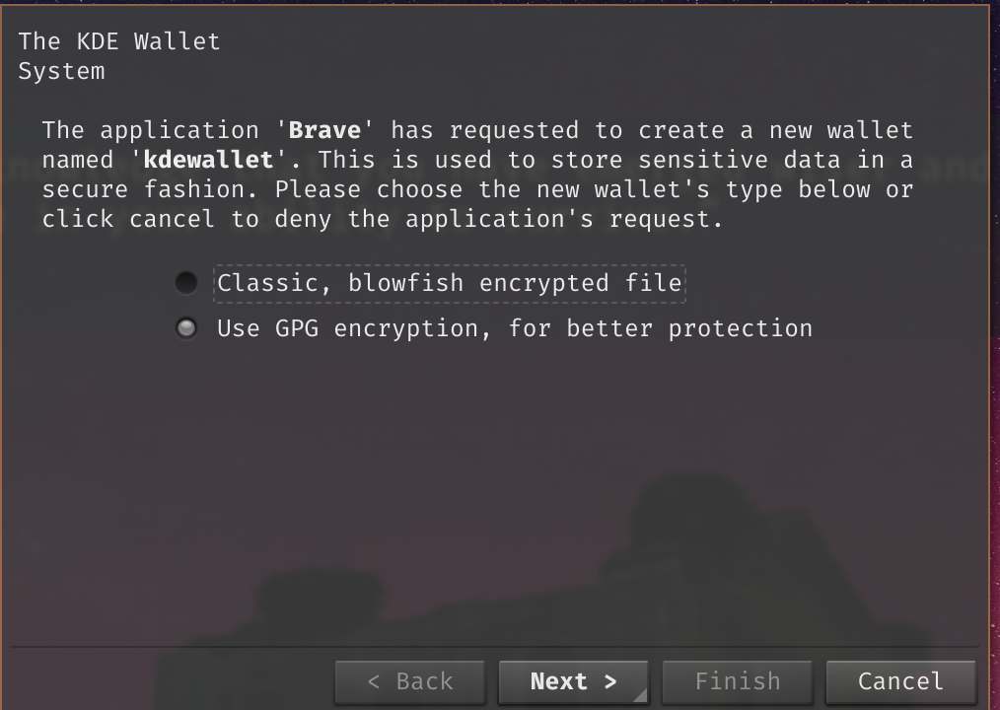
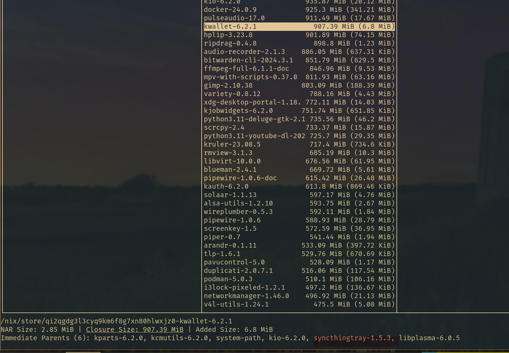
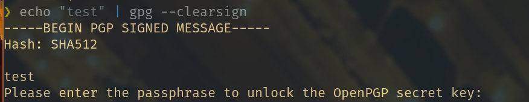
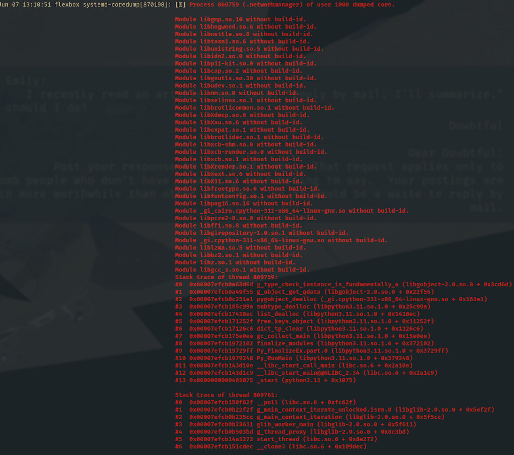

# NixOS 24.05 Upgrade Adventures

Ever feel like a major NixOS upgrade is a little like a holiday? On each upgrade. we get to discover new shiny packaged gems, solve obscure <del>family</del> kernel puzzles, or look at pretty faces in the configuration jungle.


For this particular upgrade from `23.11 Tapir`  to `24.05 Uakari`, a number of things went wrong; ranging from "annoying", to "shit I can't boot anymore!".

You might think that this a NixOS issue. It's not. On the contrary.

## The Good

### Time Travel

Let's face it, Linux Desktop (especially when you're rolling your own, as a daily driver) are a bewildering array of things stitched together with duct tape, shell pipes and optimism. With kernel upgrades and major version upgrades all happening at the same time, such as during a major NixOS upgrade, shit inevitably goes wrong. NixOS' ability to time travel, letting you boot into any old config at any time:



...turns this daunting process into something more of on a fun experiment we can run on the sides, without fear of breaking our system in unrecoverable ways and losing our daily driver.

### Discovering new FOSS Gems
Every new NixOS release, I tend to treat the [release manual](https://nixos.org/manual/nixos/stable/release-notes#sec-release-24.05) as an index to discovering exciting new tools and projects. Some random things that caught my attention this time around included:

* [Scrutiny better S.M.A.R.T monitoring](https://github.com/AnalogJ/scrutiny)
* [Vikunja open-source Todoist](https://vikunja.io/)
* [systemd-oomd](https://man.archlinux.org/man/systemd-oomd.8)
* [Rust Desk open-source Teamviewer](https://github.com/rustdesk/rustdesk)

### Simplified Pipewire/Wireplumber Config
See https://nixos.wiki/wiki/PipeWire.
This comes in super handy as I'm in the process of fully switching from PulseAudio to Pipewire. I know. 🦥

### Nix Tree
This is a fantastic UI for interactively navigating nix dependencies.
https://github.com/utdemir/nix-tree
More on that [below](#brave-and-kde-wallet-prompts).

### Home Manager Release Notes

They've likely been there for a long while, but I just discovered that home-manger does [release notes of their own](https://nix-community.github.io/home-manager/release-notes.xhtml).

### Microcode Loading

Discovered new hardware defaults by running `nixos-generate-config --hardware-config`:

https://wiki.archlinux.org/title/microcode

See [NixOS Upgrade Checklist](../Checklist.md)

### Upgrading system.stateVersion

The following [warning](https://www.reddit.com/r/NixOS/comments/16fd9t1/build_warning_enabling_both_bootenablecontainers/) was harmless but annoying, so I decided to upgrade the `system.stateVersion` from all the way back in `21.05` on this particular machine to something more recent.

Went through the [release notes](https://nixos.org/manual/nixos/stable/release-notes#sec-release-24.05) to check whether a stateVersion upgrade from `21.05` to `22.05` would have any documented effects on software I'm currently running.

Found no issues, and everything went ✅

## The Bad

### Brave and KDE Wallet Prompts

Brave browser, after the upgrade, started asking for



Turns out that the system had `kwallet` installed. But why?

`nix why-depends /run/current-system nixpkgs#kdePackages.kwallet`
```
/nix/store/jyvaws6k51mjjbf3ymn02202f5z9r818-nixos-system-flexbox-24.05.20240601.b3b2b28
└───/nix/store/h5sb0j9fi60fbkq0w02sl3m7mvaj2r1q-system-path
    └───/nix/store/qi2qgdg3l3cyq9km6f8g7xn80hlwxjz0-kwallet-6.2.1
```
hmm, not MASSIVELY informative.

https://github.com/utdemir/nix-tree to the rescue! (`?` for help)




Alright, not super happy with `syncthingtray` adding kwallet as a full on dependency but okay, things to optimize later.
For now, [appending `--password-store=seahorse` when launching Brave does the trick](https://github.com/workflow/dotfiles/commit/47b3554f443d5b25102453f90325d21e94d4f8d1).

### Broken GPG Pinentry

The problem: https://github.com/nix-community/home-manager/issues/5488

The solution: https://github.com/workflow/dotfiles/commit/a3a1688f314f0f74f4f0ce7631d558a6d378ef9a

Also, took the opportunity to replace `pinentry` with `pinentry-tty`.
Mhhhhh, much better.



## The <del>Uakari</del> Learnening

### Network Issues on Boot

First time I boot 24.05, I have no network access. Networkmanager connects, but `dns` access, `ping`, everything times out.
I try connecting to a different wifi network, and `NetworkManager` segfaults with the following scary trace:



So I go down the 🐇🕳️ and disable NetworkManager, connect via `wpa_supplicant` directly. Still no internet!
Okay I think, let's boot back into 23.11.
Still no internet. 🤔

Long story short, turns out that `mullvad` has a lockdown mode (`mullvad lockdown-mode set on`) which works very well 😂 and I still have NO IDEA how the upgrade to 24.05 activated that. #computing-mysteries

### Borked LUKS Detection
So the internet works again 🎉, and it wasn't NixOS's fault. I boot back into 24.05, to be greeted with this:


Interesting.

I boot from a flash drive, `luksOpen` the disk in question - it works fine!!
Boot again, this time it unlocks.

Turns out, every third boot or so this would happen, so we're dealing with a race condition, likely caused by either the `systemd-boot` upgrade or the upgrade of `cryptsetup` from `2.6.1` to `2.7.0`.

Without wanting to go too deep, I attempt to fix the race condition in two different ways:
1. Added boot delay with `boot.kernelParams = [ "rootdelay=10" ]` ❌ No cigar.
2. Address disk by UUID instead of label 🎉

Turns out that [specifying the LUKS Disk by UUID instead of label](https://github.com/workflow/dotfiles/commit/5f85d102e409a18a33f4e841703744855d7060c2) somehow makes the boot process more resilient, and now it unlocks on every boot.


## Final Outtakes

I decided to start a [NixOS Upgrade Checklist](../Checklist.md).


